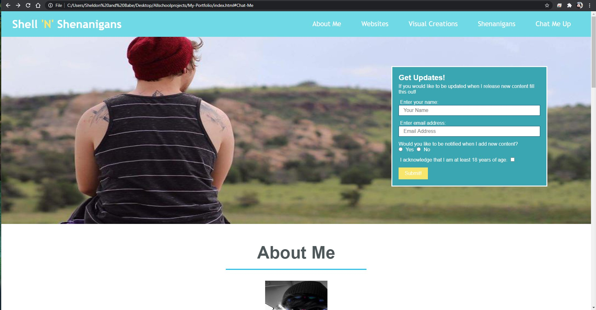

# My-Portfolio
Built my First Website!

# Portfolio
This is my portfolio where I will showcase all of my work! Not only do I have my Webisites and all Coding related content, I also have links to some of my other creative projects.

## Usage
This Website is mainly an informational page that tells readers about who I am, gives them a sneak peak into my coding progress, and provides links to other platforms that showcase my work as well as how to reach me!

## Acceptance Criteria 

GIVEN A sample of my work for potential employment
-- [x] WHEN I load their portfolio
       THEN I am presented with the developer's name, a recent photo, and links to sections about them, their work, and how to contact them
---- [x] WHEN I click one of the links in the navigation
         THEN the UI scrolls to the corresponding section
-- [x] WHEN I click on the link to the section about their work
       THEN the UI scrolls to a section with titled images of the developer's applications
---- [x] WHEN I am presented with the developer's first application
         THEN that application's image should be larger in size than the others
-- [x] WHEN I click on the images of the applications
       THEN I am taken to that deployed application
---- []WHEN I resize the page or view the site on various screens and devices
       THEN I am presented with a responsive layout that adapts to my viewport

## Preview 

## Link

https://sstevens22.github.io/My-Portfolio/

https://github.com/sstevens22/My-Portfolio